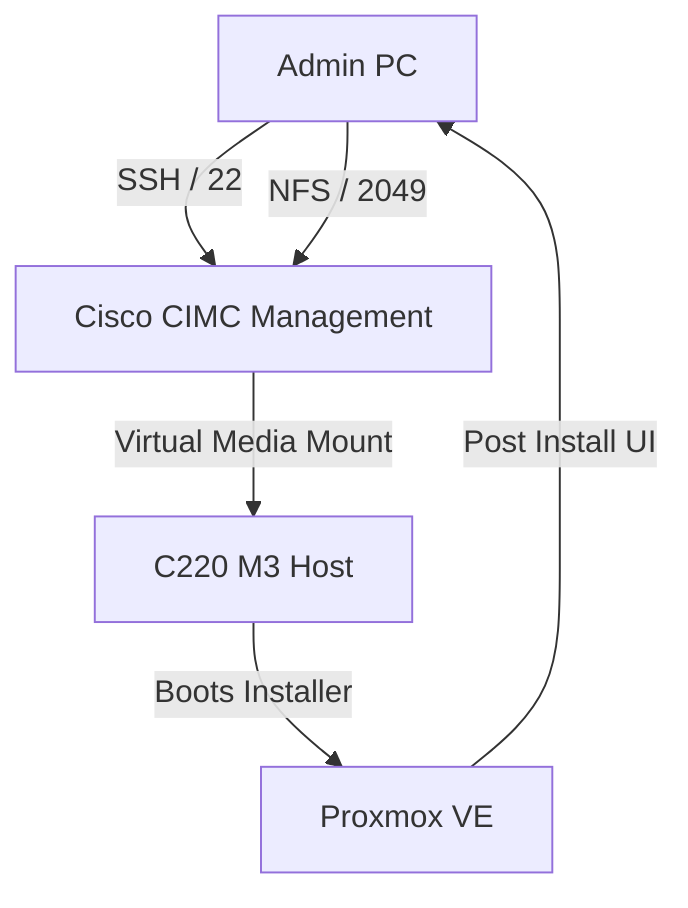

# Cisco C220 M3 Proxmox Transformation


This repository documents the architectural transition of a legacy **Cisco UCS C220 M3** from VMware ESXi to a modern **Proxmox VE** environment. 

### 🎯 The Problem
Legacy enterprise hardware (M3 generation) uses **Adobe Flash** and **Java** for management. Since these technologies are deprecated, standard browser-based administration is impossible. 

### 💡 The Solution
A "Headless Deployment" strategy using:
*   **SSH CLI Management** to bypass the Flash WebUI.
*   **NFS vMedia Mounting** to reliably "feed" the OS installer to the server.
*   **Legacy Browser Workarounds** (Pale Moon) only for the final GUI installation phase.

---

## 🗺 System Architecture



---

## 📂 Repository Contents

*   **[INSTRUCTIONS.md](./INSTRUCTIONS.md)**: Technical walkthrough of the installation.
*   **[LESSONS_LEARNED.md](./LESSONS_LEARNED.md)**: Deep dive into NIC modes and CIMC quirks.
*   **[CIMC_SSH_HELP.md](./CIMC_SSH_HELP.md)**: CLI reference for Cisco C-Series.
*   **[scripts/](./scripts/)**: Automation tools for NFS host setup.

## 🛠 Hardware Specifications
*   **Server:** Cisco UCS C220 M3 LFF
*   **CPU:** Dual Intel Xeon E5-2600 Series
*   **Storage Configuration:**
    *   1x 120GB Kingston SSD (Boot/OS)
    *   2x 300GB SAS 10K (ZFS Mirror - VM Data)
    *   1x 1TB HDD (Storage/Backups)

## 🔧 Quick Start (NFS Automation)
To quickly set up your management machine as an ISO server:
```bash
sudo ./scripts/setup_nfs_host.sh <CIMC_IP>
```

---
*Developed for professional lab modernization by [dweber33](https://github.com/dweber33)*
